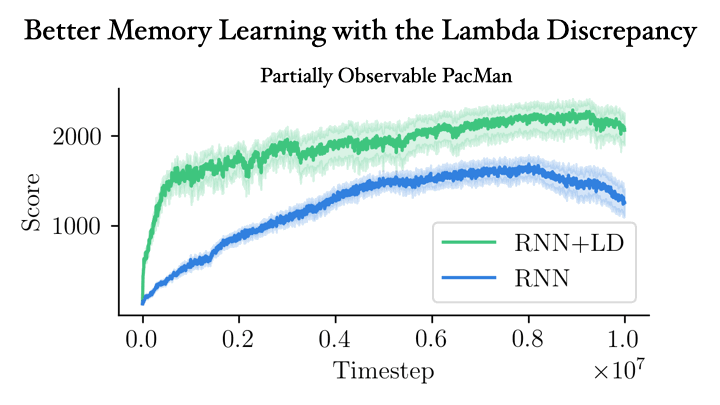
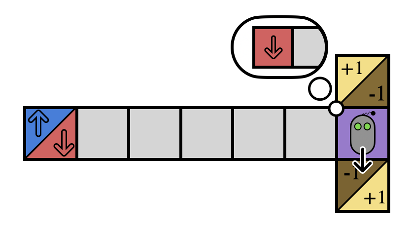
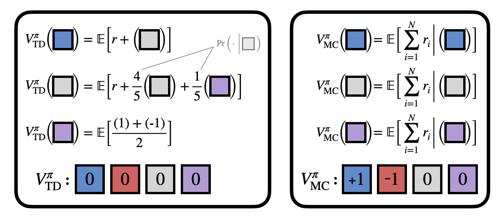
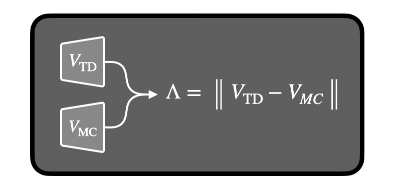
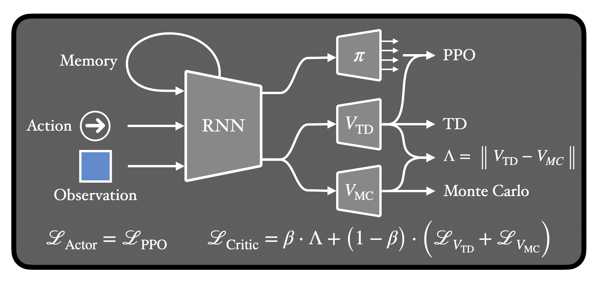
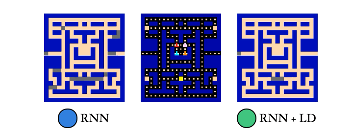
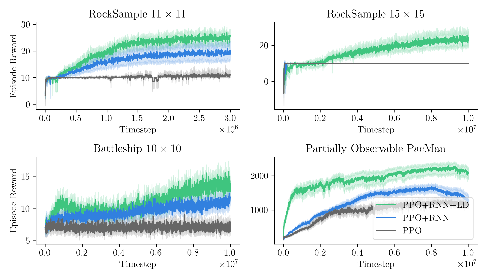

<!-- # Mitigating Partial Observability in Sequential Decision Processes via the Lambda Discrepancy -->

[Cameron Allen](https://camallen.net),1\* [Aaron Kirtland](https://atkirtland.github.io/),2\* [Ruo Yu Tao](https://taodav.cc/),2\* [Sam Lobel](https://samlobel.github.io/),2 [Daniel Scott](https://dsctt.github.io/),3 [Nicholas Petrocelli](https://www.linkedin.com/in/nicholasrp/),2 [Omer Gottesman](https://omergott.github.io/),4 [Ronald Parr](https://users.cs.duke.edu/~parr/),5 [Michael L. Littman](https://www.littmania.com),2 [George Konidaris](https://cs.brown.edu/~gdk/)2

1UC Berkeley, 2Brown University, 3Georgia Tech, 4Amazon, 5Duke University
 *Equal Contribution

  <a href="https://arxiv.org/pdf/2407.07333">
    <button class="border hover:text-white hover:bg-black border-solid border-black rounded-md px-4 py-1 mr-4">
      

        <svg viewBox="0 0 24 24" width="1.2em" height="1.2em" class="inline-block mr-1">
          <g fill="none" fill-rule="evenodd">
          <path d="M24 0v24H0V0zM12.593 23.258l-.011.002l-.071.035l-.02.004l-.014-.004l-.071-.035c-.01-.004-.019-.001-.024.005l-.004.01l-.017.428l.005.02l.01.013l.104.074l.015.004l.012-.004l.104-.074l.012-.016l.004-.017l-.017-.427c-.002-.01-.009-.017-.017-.018m.265-.113l-.013.002l-.185.093l-.01.01l-.003.011l.018.43l.005.012l.008.007l.201.093c.012.004.023 0 .029-.008l.004-.014l-.034-.614c-.003-.012-.01-.02-.02-.022m-.715.002a.023.023 0 0 0-.027.006l-.006.014l-.034.614c0 .012.007.02.017.024l.015-.002l.201-.093l.01-.008l.004-.011l.017-.43l-.003-.012l-.01-.01z"></path>
          <path fill="currentColor" d="M13.586 2a2 2 0 0 1 1.284.467l.13.119L19.414 7a2 2 0 0 1 .578 1.238l.008.176V20a2 2 0 0 1-1.85 1.995L18 22H6a2 2 0 0 1-1.995-1.85L4 20V4a2 2 0 0 1 1.85-1.995L6 2zM12 4H6v16h12V10h-4.5a1.5 1.5 0 0 1-1.493-1.356L12 8.5zm.988 7.848a6.223 6.223 0 0 0 2.235 3.872c.887.717.076 2.121-.988 1.712a6.223 6.223 0 0 0-4.47 0c-1.065.41-1.876-.995-.989-1.712a6.222 6.222 0 0 0 2.235-3.872c.178-1.127 1.8-1.126 1.977 0m-.99 2.304l-.688 1.196h1.38zM14 4.414V8h3.586z"></path>
          </g>
        </svg>
        Paper
      

    </button>
  </a>
  <a href="https://arxiv.org/abs/2407.07333">
    <button class="border hover:text-white hover:bg-black border-solid border-black rounded-md px-4 py-1 mr-4">
      

        <svg viewBox="0 0 24 24" width="1.2em" height="1.2em" class="inline-block mr-1">
          <path fill="currentColor" d="M3.842 0a1 1 0 0 0-.922.608c-.153.369-.044.627.294 1.111l6.919 8.36l-1.023 1.106a1.04 1.04 0 0 0 .003 1.423l1.23 1.313l-5.44 6.444c-.28.3-.453.823-.297 1.199a1.025 1.025 0 0 0 .959.635a.91.91 0 0 0 .689-.34l5.783-6.126l7.49 8.005a.85.85 0 0 0 .684.26a.96.96 0 0 0 .877-.615c.158-.377-.017-.75-.306-1.14L13.73 13.9l1.064-1.13a.963.963 0 0 0 .009-1.316L4.633.464S4.26.01 3.867 0zm0 .272h.017c.218.005.487.272.564.364l.005.006l.005.005l10.17 10.99a.69.69 0 0 1-.008.946l-1.066 1.133l-1.498-1.772l-8.6-10.39c-.328-.472-.352-.619-.26-.841a.73.73 0 0 1 .671-.44Zm14.341 1.57a.88.88 0 0 0-.655.242l-5.696 6.158l1.694 1.832l5.309-6.514c.325-.433.479-.66.325-1.029a1.12 1.12 0 0 0-.977-.689m-7.655 12.282l1.318 1.414l-5.786 6.13a.65.65 0 0 1-.496.26a.75.75 0 0 1-.706-.467c-.112-.269.036-.687.244-.909l.005-.005l.005-.006z"></path>
        </svg>
        arXiv
      

    </button>
  </a>
  <a href="https://github.com/brownirl/lambda_discrepancy">
    <button class="border hover:text-white hover:bg-black border-solid border-black rounded-md px-4 py-1 undefined">
      

        <svg viewBox="0 0 24 24" width="1.2em" height="1.2em" class="inline-block mr-1">
          <path fill="currentColor" d="M12 2A10 10 0 0 0 2 12c0 4.42 2.87 8.17 6.84 9.5c.5.08.66-.23.66-.5v-1.69c-2.77.6-3.36-1.34-3.36-1.34c-.46-1.16-1.11-1.47-1.11-1.47c-.91-.62.07-.6.07-.6c1 .07 1.53 1.03 1.53 1.03c.87 1.52 2.34 1.07 2.91.83c.09-.65.35-1.09.63-1.34c-2.22-.25-4.55-1.11-4.55-4.92c0-1.11.38-2 1.03-2.71c-.1-.25-.45-1.29.1-2.64c0 0 .84-.27 2.75 1.02c.79-.22 1.65-.33 2.5-.33s1.71.11 2.5.33c1.91-1.29 2.75-1.02 2.75-1.02c.55 1.35.2 2.39.1 2.64c.65.71 1.03 1.6 1.03 2.71c0 3.82-2.34 4.66-4.57 4.91c.36.31.69.92.69 1.85V21c0 .27.16.59.67.5C19.14 20.16 22 16.42 22 12A10 10 0 0 0 12 2"></path>
        </svg>
        Code
      

    </button>
  </a>

## Paper Summary

RL in POMDPs is hard because you need memory. Remembering *everything* is expensive, and RNNs can only get you so far applied naively.

In this paper, we introduce a theory-backed loss function that greatly improves RNN performance!

{: align="center"}

The key insight is to use two value functions. In POMDPs, temporal difference (TD) and Monte Carlo (MC) value estimates can look very different. We call this mismatch the λ-discrepancy and we use it to detect partial observability.

{: align="center"}

Here's a quick example. Imagine you’re stuck inside this T-maze. If you can reach the +1, you win, and -1 you lose, but all you see is the current square. Without a map, how can you decide which way to go from the junction?

{: align="center"}

If you remember your whole history, you might notice the starting blue/red observation reveals the optimal action. But in general your history might be really long, so you only want to remember what you absolutely must.

{: align="center"}

How do we know if we need memory? This is where the value functions come in!

TD and MC have a λ-discrepancy in the T-maze, because TD uses bootstrapping (which makes an implicit Markov assumption), while MC computes a simple average.

{: align="center"}

We can use the λ-discrepancy to detect partial observability. And it’s a very reliable signal!

We prove that if *some* policy has λ-discrepancy, then *almost all* policies will. Meanwhile, there is never a discrepancy for MDPs. (See the [paper](https://arxiv.org/pdf/2407.07333) for the proofs.)

Okay, math is great, but how do we find a λ-discrepancy in practice? It's actually super simple: just train two value functions and check the difference between them!

(Technically, we can compare TD(λ) for any two different λ values.)

{: align="center"}

If we use an RNN, we can learn not just *when* we need memory, but also *what* state information to remember! All we do is minimize the λ-discrepancy while we train the value functions. And we can even train a policy at the same time!

{: align="center"}

We also trained a probe to reconstruct the PacMan dots from the agent’s memory. Guess which agent had an easier time with this… Yep! The λ-discrepancy agent knows where it has been, while the normal RNN agent basically has no idea.

{: align="center"}

So to recap: (1) λ-discrepancy can detect partial observability; (2) reducing it leads to memories that support better policies; and (3) it significantly improves performance on challenging POMDPs.

{: align="center"}

Check out the full [paper](https://arxiv.org/pdf/2407.07333) to learn more!

## Citation

<pre class="bibtex">
@article{allenkirtlandtao2024lambdadiscrep,
  title   = {Mitigating Partial Observability in Sequential Decision Processes via the Lambda Discrepancy},
  author  = {Allen, Cameron and Kirtland, Aaron and Tao, Ruo Yu and Lobel, Sam and Scott, Daniel and Petrocelli, Nicholas and Gottesman, Omer and Parr, Ronald and Littman, Michael L. and Konidaris, George},
  journal = {arXiv},
  eid     = {2407.07333},
  year    = {2024}
}
</pre>
 

We acknowledge and thank Saket Tiwari, Anita de Mello Koch, Sam Musker, Brad Knox, Michael Dennis, Stuart Russell, and our colleagues at Brown University and UC Berkeley for their valuable advice and discussions towards completing this work. We also thank our reviewers from NeurIPS'23 and ICLR'24 for comments on earlier drafts.

This work was generously supported under NSF grant 1955361 and CAREER grant 1844960 to George Konidaris, NSF fellowships to Aaron Kirtland and Sam Lobel, ONR grant N00014-22-1-2592, a gift from Open Philanthropy to the Center for Human-Compatible AI at Berkeley, and an AI2050 Senior Fellowship for Stuart Russell from the Schmidt Fund for Strategic Innovation.
